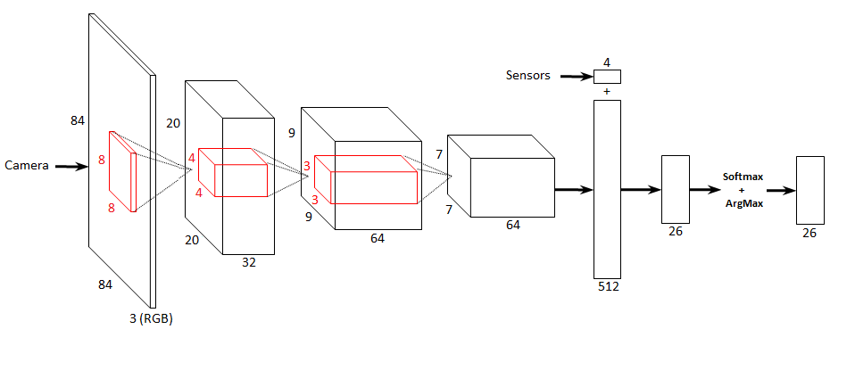
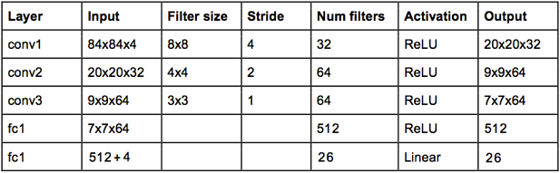

# Deep reinforcement learning algorithm

## Table of contents:
* [Robot environment](#robot_environment)
* [Convolutional neural network](#cnn)
* [Plotting](#plot)
* [Training](#training)

## Robot environment <a class="anchor" id="robot_environment"></a>

A `EnvRobot` class was developped to simplify exchanges between the reinforcement learning script and the server.
It allows to :
+ Initialize the robot environment
+ Reset the robot environment
+ Give an order to the robot (up, down, left...)
+ Recover information from the robot (camera, position, senors...)

##### Initialization

1. **Start** the server
2. Initialize all variables related to the **server**
3. Initialize all variables related the **camera and sensors**
4. Initialize all variables related the **simulation**
>+ **`step_size`** : size of a robot step
>+ **`angle`** : limits of the robot angle <br>(ex : if `angle` = 20, 20° to the left, 20° to the right)
>+ **`height_max`/`height_min`** : limits of the height robot <br>(to find values : test with the `manual` stcript)
>+ **`time_size`** : time for a step robot
>+ **`total_step`** : total step in 1 episode
>+ **`reward_step`** : reward for each step
>+ **`reward_win`/`reward_lose`** : reward when the robot acheived the goal/crash into the limits
>+ **`reward_pixel_max`** : maximum reward for red pixels <br>(ex : if `reward_pixel_max = 30` and the red cube take `10%` of the image, the reward for red pixels will be `3`)


```python
# start server
self.server = tcp_server()
ip, port = get_server_settings()
self.server.connect(ip, port)

#Attributes initialization

#For interaction with the server
self.base               = 0.0
self.lnk1               = 69.0
self.lnk2               = -85.0
self.time               = 1.0
self.reset              = False
self.camera             = None
self.actual_position    = None
self.target_position    = None

#Camera size
self.camera_width = 256
self.camera_height = 256

#Sensors
self.sensor_up          = 0.0
self.sensor_down        = 0.0
self.sensor_left        = 0.0
self.base_left          = 0.0
self.sensor_right       = 0.0
self.base_right         = 0.0

#Simulation parameters
self.step_size          = 4
self.angle              = 20
self.height_max         = 21.0
self.height_min         = 7.0
self.time_size          = 0.000001
self.total_step         = total_step
self.reward_step        = -0.5
self.reward_win         = 200 
self.reward_lose        = -200
self.reward_pixel_max   = 30.0

```

##### Reset

1. **Reset** all variables related to the server
2. **Pack** these data for server
3. **Send** this package to the server
4. **Updtate** all variables related to the server
5. **Reset** the state (image and sensors)


```python
 def res(self, reset_cube=False):

    #Reset function
    self.base               = 0.0
    self.lnk1               = 69.0
    self.lnk2               = -85.0
    self.time               = 0.00001
    self.reset              = reset_cube
    self.camera             = None
    self.actual_position    = None
    self.target_position    = None
    data_to_server = (0.0,0.0,0.0,0.0,False)
    data_to_server = list(data_to_server)
    data_to_server[0] = self.time
    data_to_server[1] = self.base   
    data_to_server[2] = self.lnk1   
    data_to_server[3] = self.lnk2
    data_to_server[4] = self.reset
    data_to_server = tuple(data_to_server)
    to_server(self.server,data_to_server)
    data_from_server = from_server(self.server)

    self.camera          = data_from_server[0]
    self.actual_position = data_from_server[1]
    self.target_position = data_from_server[2]
    self.base            = data_from_server[3]
    self.lnk1            = data_from_server[4]
    self.lnk2            = data_from_server[5]
    self.time = 1.0
    self.reset = False

    img = np.array(self.camera.resize((84,84), Image.ANTIALIAS))
    sensors = np.array([0,0,0,0])
    state = np.array([img, sensors])

    return state
```

##### Step

First, we **update** all variables related to the server


```python
#Robot data reception from the server
data_from_server = from_server(self.server)
self.camera          = data_from_server[0]
self.actual_position = data_from_server[1]
self.target_position = data_from_server[2]
self.base            = data_from_server[3]
self.lnk1            = data_from_server[4]
self.lnk2            = data_from_server[5]
self.time = self.time_size
self.reset = False
```

We can now **calculate the next order** for the robot with the function `do_action`.


```python
#Calculate the new position from the action
self.base, self.lnk1, self.lnk2 = do_action(action, self.base, self.lnk1, self.lnk2, self.step_size)
```

`do_action` take in argument :
+ the **action to do**
+ the **position of the robot**
+ the **step size**
It retuns :
+ the** movement to be perfomed** by the robot


```python
def do_action(action, base, lnk1, lnk2, step):
 
    if action == 0:
        base += step #Base+
    elif action == 1:
        base -= step #Base-
    elif action == 2:        
        lnk1 += step #Lnk1+
    elif action == 3:
        lnk1 -= step #Lnk1-
    elif action == 4:
        lnk2 += step #Lnk2+
    elif action == 5:
        lnk2 -= step #Lnk2-
    elif action == 6:
        base += step #Base+,Lnk1+
        lnk1 += step
    elif action == 7:
        base += step #Base+,Lnk1-
        lnk1 -= step
    elif action == 8:
        base -= step #Base-,Lnk1+
        lnk1 += step
    elif action == 9:
        base -= step #Base-,Lnk1-
        lnk1 -= step
    elif action == 10:
        base += step #Base+,Lnk2+
        lnk2 += step
    elif action == 11:
        base += step #Base+,Lnk2-
        lnk2 -= step
    elif action == 12:
        base -= step #Base-,Lnk2+
        lnk2 += step
    elif action == 13:
        base -= step #Base-,Lnk2-
        lnk2 -= step
    elif action == 14:
        lnk1 += step #Lnk1+, Lnk2+
        lnk2 += step
    elif action == 15:
        lnk1 += step #Lnk1+, Lnk2-
        lnk2 -= step
    elif action == 16:
        lnk1 -= step #Lnk1-, Lnk2+
        lnk2 += step
    elif action == 17:
        lnk1 -= step #Lnk1-, Lnk2-
        lnk2 -= step
    elif action == 18:
        base += step # Base+, Lnk1+, Lnk2+
        lnk1 += step
        lnk2 += step
    elif action == 19:
        base += step # Base+, Lnk1+, Lnk2-
        lnk1 += step
        lnk2 -= step
    elif action == 20:
        base += step # Base+, Lnk1-, Lnk2+
        lnk1 -= step
        lnk2 += step
    elif action == 21:
        base += step # Base+, Lnk1-, Lnk2-
        lnk1 -= step
        lnk2 -= step
    elif action == 22:
        base -= step # Base-, Lnk1+, Lnk2+
        lnk1 += step
        lnk2 += step
    elif action == 23:
        base -= step # Base-, Lnk1+, Lnk2-
        lnk1 += step
        lnk2 -= step
    elif action == 24:
        base -= step # Base-, Lnk1-, Lnk2+
        lnk1 -= step
        lnk2 += step
    elif action == 25:
        base -= step # Base-, Lnk1-, Lnk2-
        lnk1 -= step
        lnk2 -= step
    else:
        print("[ERROR] The action %d doesn't exist" % action)

    return base, lnk1, lnk2
```

It's time to move the robot.
1. **Send** the movement to the robot
2. **Update** the new position

<div class="alert alert-warning">
<b>NOTE</b> After sending the data to the server, it's obligatory to receive the feedback.
</div>


```python
#Send the action to the server
data_to_server = (0.0,0.0,0.0,0.0,False)
data_to_server = list(data_to_server)
data_to_server[0] = self.time
data_to_server[1] = self.base   
data_to_server[2] = self.lnk1   
data_to_server[3] = self.lnk2
data_to_server[4] = self.reset
data_to_server = tuple(data_to_server)
to_server(self.server,data_to_server)


#Update attributes from the server
data_from_server = from_server(self.server)
self.camera          = data_from_server[0]
self.actual_position = data_from_server[1]
self.target_position = data_from_server[2]
self.base            = data_from_server[3]
self.lnk1            = data_from_server[4]
self.lnk2            = data_from_server[5]
self.time = self.time_size
self.reset = False
data_to_server = (0.0,0.0,0.0,0.0,False)
data_to_server = list(data_to_server)
data_to_server[0] = 0.0
data_to_server[1] = self.base   
data_to_server[2] = self.lnk1   
data_to_server[3] = self.lnk2
data_to_server[4] = self.reset
data_to_server = tuple(data_to_server)
to_server(self.server,data_to_server)
```

After that, we can **process** the received data to obtain environment observations.<br>
First, we **calculate** the value of our virtual sensors.


```python
#Virtual sensors (Robot point of view)
self.sensor_up = self.height_max - self.actual_position.y
self.sensor_down = self.actual_position.y - self.height_min
if self.base <= 180:
    self.sensor_left = self.angle - self.base
    self.sensor_right = self.angle + self.base
else:
    self.sensor_left = self.angle + (360 - self.base)
    self.sensor_right = self.base - (360 - self.angle)
```

And after, we **exploit** camera data.


```python
 #Camera resizing for covnet
img = np.array(self.camera.resize((84,84), Image.ANTIALIAS))
```

We can have now **our current state**.


```python
sensors = np.array([self.sensor_up, self.sensor_down, self.sensor_left, self.sensor_right])
state = np.array([img, sensors])
```

To know if **the current episode is finished or not** (crash or achieved goal), we **fix some conditions** about limits in space and red pixels.


```python
#Movement
left_done = bool(self.sensor_left <= -self.step_size)
right_done = bool(self.sensor_right <= -self.step_size)
up_done = bool(self.sensor_up <= -1)
down_done = bool(self.sensor_down <= -1)
lnk1_done = bool(self.lnk1 > 90.0)

#Camera pixel
red_pixel_camera = red_pixel(self.camera)                   #0 to 65536
red_pixel_camera /= self.camera_width * self.camera_height  #0 to 1
red_pixel_camera *= self.reward_pixel_max                   #ex: 0 to 30
"""red_pixel_camera -= 0.5                                  #-0.5 to 0.5
red_pixel_camera *= self.reward_pixel_max*2                 #ex : -30 to 30"""
pixel_done = bool(red_pixel_camera == self.reward_pixel_max)

done = left_done or right_done or up_done or down_done or lnk1_done or pixel_done
```

And finally, we calculate the **current stqte reward** and return all **step observations**.<br>
If the episode is not finished : `reward = reward for each step + reward from the camera`<br>
If the episode is finished, we **test if the goal is achieved** and we **calculate the corresponding reward**.


```python
if not done:
    #Continue

    #Reward calculation
    reward = self.reward_step + red_pixel_camera
else:
    #Finish
    if pixel_done:
        #Achived goal
        reward = self.reward_win
    else:
        #Fail / Crash
        reward = self.reward_lose

return state, reward, done, pixel_done
```

## Convolutional neural network <a class="anchor" id="cnn"></a>

A `ConvolutionalNeuralNetwork` class was developped to implement the CNN in charge of the action decision.
It's inspired by _DeepMind_ convolutionnal neural network.





##### Initialization
First we define networks parameters


```python
#Input image size
self.img_x = 84
self.img_y = 84
self.img_channel = 3

#Network Parameters 
self.n_image = self.img_x * self.img_y  # data input (img shape: 84*84)
self.n_classes = 26                     # total classes (actions)
self.dropout = 0.75                     # Dropout, probability to keep units
self.learning_rate=0.003                #Learning rate to update covnet
```

Then, we define the inputs/outputs placeholders.
<br><br>
_INPUT_
+ **input_image**: 84x84x3 float
+ **keep_prob**: 1 float (0 ≤ keep_prob < 1)
+ **reward_holder**: 1 float 
+ **action_holder**: 1 int (0 ≤ action_holder < 27)
+ **sensors**: 4 float [up, down, left, right]

_OUTPUT_
+ **Q**: 26 float (action prediction)


```python
#Covnet input
#Input image (84x84x3)
self.input_image = tf.placeholder(tf.float32, [None, self.img_x, self.img_y, self.img_channel])
#Dropout (keep probability)
self.keep_prob = tf.placeholder(tf.float32)
#Obtained reward
self.reward_holder = tf.placeholder(shape=[None],dtype=tf.float32)
#Achieved action
self.action_holder = tf.placeholder(shape=[None],dtype=tf.int32)
#Sensors
self.sensors = tf.placeholder(shape=[None,4],dtype=tf.float32)
#Covnet output
self.Q = tf.placeholder(tf.float32, [None, self.n_classes])
```

We initialize :
+ **weights** with normal repartition
+ **biases** with ones (and zeros for the last layer)


```python
#Store layers weight & bias
self.weights = {
    # 8x8 conv, 1 input, 32 outputs
    'wc1': tf.Variable(tf.truncated_normal([8, 8, 3, 32], 0.0)),
    # 4x4 conv, 32 inputs, 64 outputs
    'wc2': tf.Variable(tf.truncated_normal([4, 4, 32, 64], 0.0)),
    # 3x3 conv, 64 inputs, 64 ones
    'wc3': tf.Variable(tf.truncated_normal([3, 3, 64, 64], 0.0)),
    # fully connected, 7*7*64 inputs, 512 outputs
    'wd1': tf.Variable(tf.truncated_normal([7*7*64, 512], 0.0)),
    # 516 inputs, 26 outputs (class prediction)
    'out': tf.Variable(tf.truncated_normal([516, self.n_classes]))
}

self.biases = {
    'bc1': tf.Variable(tf.ones([32])),
    'bc2': tf.Variable(tf.ones([64])),
    'bc3': tf.Variable(tf.ones([64])),
    'bd1': tf.Variable(tf.ones([512])),
    'out': tf.Variable(tf.zeros([self.n_classes]))
}
```

##### Creation

We create a function to create our CNN.
1. Reshape the image to **84x84x3**
2. Create **3 convolution layers**
3. Create the **full connected layer**
4. Apply a **dropout** to avoid overfitting
5. Add the **sensors value**
6. Calculate the **output**


```python
# Create model
def conv_net(self, x, weights, biases, dropout):

    #DeepMind Neural Network
    #https://www.intelnervana.com/demystifying-deep-reinforcement-learning/

    print("\nConvolutional neural network characteristic :")
    # Reshape input picture
    x = tf.reshape(x, shape=[-1, self.img_x, self.img_y, 3])
    print("Input      : ", x._shape)

    # Convolution Layer
    conv1 = conv2d(x, weights['wc1'], biases['bc1'], 4)
    print("Conv 1     : ", conv1._shape)

    # Convolution Layer
    conv2 = conv2d(conv1, weights['wc2'], biases['bc2'], 2)
    print("Conv 2     : ", conv2._shape)

    # Convolution Layer
    conv3 = conv2d(conv2, weights['wc3'], biases['bc3'], 1)
    print("Conv 3     : ", conv3._shape)

    # Fully connected layer
    # Reshape conv2 output to fit fully connected layer input
    fc1 = tf.reshape(conv3, [-1, weights['wd1'].get_shape().as_list()[0]])
    print("Reshape    : ", fc1.shape)
    fc1 = tf.add(tf.matmul(fc1, weights['wd1']), biases['bd1'])
    print("Calculate  : ", fc1.shape)
    fc1 = tf.nn.relu(fc1)
    print("Relu       : ", fc1.shape)
    # Apply Dropout
    fc1 = tf.nn.dropout(fc1, dropout)
    print("Dropout    : ", fc1.shape)
    fc1 = tf.concat([fc1,self.sensors],1)
    print("Merge      : ", fc1.shape)
    # Output, class prediction
    out = tf.add(tf.matmul(fc1, weights['out']), biases['out'])
    print("Out        : ", out.shape)
    print("\n")
    return out
        

# Create some wrappers for simplicity
def conv2d(x, W, b, strides):
    # Conv2D wrapper, with bias and relu activation
    x = tf.nn.conv2d(x, W, strides=[1, strides, strides, 1], padding='VALID')
    x = tf.nn.bias_add(x, b)    
    return tf.nn.relu(x)
```

Now, it's time to construct our forward graph.
1. **Normalization** : pixel are converted from integer between 0 to 255 to float between -1 and 1
2. **Forwarding** : with our function conv_net
3. **Calculating softmax** : to obtain percentage of each action
4. **Calculating argmax** : to obtain the max of the softmax function


```python
#Normalization : 0 to 255 => -1 to 1
self.input_image = tf.multiply(tf.subtract(tf.scalar_mul((1.0/255.0), self.input_image),0.5),2.0) 

#Select action
#Covnet
self.Q = self.conv_net(self.input_image, self.weights, self.biases, self.keep_prob)
#Softmax function
self.soft = tf.nn.softmax(self.Q)
#Maximum argument of softmax
self.chosen_action = tf.argmax(self.soft,1) 
```

And after, we create our updating graph.
1. Find the **weight of the achieved action** in the output layer
2. Calculate the **loss** (`-log(π)*A`)
3. **Optimize our model** with a specified learning rate (usually between 0.1 and 0.001)


```python
#Responsible weight finding thanks to the achieved action
self.responsible_weight = tf.slice(self.Q[0],self.action_holder,[1])
#Loss calculation : -(log(responsible_weight) * reward_holder)
self.log = tf.log(self.responsible_weight)
self.loss = -(self.log*self.reward_holder)
#Optimization
optimizer = tf.train.AdamOptimizer(learning_rate=self.learning_rate)
self.updateModel = optimizer.minimize(self.loss)
```

The graph is ready to be created !

## Plotting <a class="anchor" id="plot"></a>

A `PlotReward` class was developped **to plot the results in a graph**.

##### Initialization

First, we **recover the name of the simulation** placed in argument.


```python
self.simulation_name = simulation_name
```

We **define our data list** for each family results.


```python
#Abcissa
self.xdata = []
#Ordinates
self.ydata = []
self.y2data = []
self.y3data = []
self.y4data = []
self.y5data = []
```

We initialize plot parameters.
+ **nb_done** : number of achieved goal
+ **nb_crash** : number of crash
+ **nb_fail** : number of fail (the robot don't achieved the goal without crash)
+ **nb_episodes** : number of episodes
+ **destination** : destionation where the graph will be saved
+ **nb_filename** : find the name of the graph


```python
#Initialization
self.nb_done = 0
self.nb_crash = 0
self.nb_fail = 0
self.nb_episode = 0
self.destination = "save/plot/"
self.nb_filename = find_name(self.destination)
```

`find_name` function **returns the graph number** (ex : reward(?).png)


```python
#Find the name of the plot for saving : reward(?).png
def find_name(destination):
    done = False
    i=0
    while(not(done)):
        if os.path.isfile(destination + 'reward(' + str(i) + ').png'):
            i += 1
        else:
            done = True
    return str(i)
```

Now, we **create our graph**.

1. **Create** the windows 
2. **Add** the name of the simulation in windows title
3. **Format** the graph
4. **Add** labels and graph title
5. **Create** our curves and points


```python
#Create plot windows
plt.figure(figsize=(8,7), num=self.simulation_name)

#Add a suptittle
plt.suptitle(self.simulation_name, fontsize=14, fontweight='bold')

#Select windows
self.axes_reward = plt.gca()
#Shrink graph size for the legend
box = self.axes_reward.get_position()
self.axes_reward.set_position([box.x0, box.y0, box.width * 0.8, box.height])
self.axes_reward.set_title('Reward for each episode')
#Abcissa & ordinates labels
self.axes_reward.set_xlabel('Episode')
self.axes_reward.set_ylabel('Reward ')
#Create curves 
self.line, = self.axes_reward.plot(self.xdata, self.ydata, color='silver', label='Reward')
self.line2, = self.axes_reward.plot(self.xdata, self.y2data, linestyle='dotted', color='black', label='Average')
self.point, = self.axes_reward.plot(self.xdata, self.y3data, linestyle='None', marker='o', markerfacecolor='g', markeredgewidth=0.0, label='Done')
self.point2, = self.axes_reward.plot(self.xdata, self.y4data, linestyle='None', marker='o', markerfacecolor='r', markeredgewidth=0.0, label='Crash')
self.point3, = self.axes_reward.plot(self.xdata, self.y5data, linestyle='None', marker='o', markerfacecolor='orange', markeredgewidth=0.0, label='Fail')
```

##### Plot

First, we **update all values** of our graph.
1. **Curves** values (episode reward and average reward)
2. **Points** values (done, fail and crash)


```python
#Add values to the graph
self.xdata.append(episode)
self.ydata.append(data[episode])
self.y2data.append(avg_reward[episode])

#Add value for "Done" or "Crash" or "Fail"
if pixel_done:
    self.y3data.append(data[episode])
    self.nb_done += 1
else:
     self.y3data.append(None)
if done and not(pixel_done):
    self.y4data.append(data[episode])
    self.nb_crash += 1
else:
     self.y4data.append(None)
if not(done) and not(pixel_done):
    self.y5data.append(data[episode])
    self.nb_fail += 1
else:
     self.y5data.append(None)


#Counting the number of episodes
self.nb_episode += 1   
```

We can now **add the new values to the graph**.


```python
#Update graph values
self.line.set_xdata(self.xdata)
self.line.set_ydata(self.ydata)
self.line2.set_xdata(self.xdata)
self.line2.set_ydata(self.y2data)
self.point.set_xdata(self.xdata)
self.point.set_ydata(self.y3data)
self.point2.set_xdata(self.xdata)
self.point2.set_ydata(self.y4data)
self.point3.set_xdata(self.xdata)
self.point3.set_ydata(self.y5data)
```

We **adjust the limit of the graph**.


```python
#Update the limit of the graf in function of graph values
self.axes_reward.set_xlim(0, episode+1)
self.axes_reward.set_ylim(worst_reward - 10, best_reward + 10)
```

We **plot the corresponding legend** with percentages of done, fail and crash.


```python
#Update legend
plt.legend([self.line, self.line2, self.point, self.point3, self.point2], ['Reward', 'Average', 'Done (%.2f%%)' % ((self.nb_done/self.nb_episode)*100), 'Fail (%.2f%%)' % ((self.nb_fail/self.nb_episode)*100), 'Crash (%.2f%%)' % ((self.nb_crash/self.nb_episode)*100)], loc='center left', bbox_to_anchor=(1, 0.5))
```

And finally **we draw and save the graph**. 


```python
plt.draw()
#Save the graph
plt.savefig(self.destination + 'reward('+ self.nb_filename +').png')
plt.pause(0.05)
```

## Training <a class="anchor" id="training"></a>

For the moment, we can interact with our robot environement, use our CNN and plot the results.<br>
Let's start **to create a training** for our robot !

##### Initialization

We define and intialize simulation parameters.

+ **total_episode** : number of episode in the training
+ **total_step** : number of step in each episode
+ **best_episode_reward** : information to know the best reward in an episode
+ **best_reward** : information to know the best episode reward in the training
+ **worst_reward** : information the know the worst episode reward in the training
+ **avg_reward** : information the know the average reward in the training
+ **e** (epsilon) : percentage to do a random action
+ **pixel_done** : True if the goal is achieved
+ **reset_crash** : reset red cube position after n crash
+ **nb_pixel_crash** : counter for the number of crash


```python
#Simulation parameters
total_episodes = 1000
total_step = 30
best_episode_reward = 0.0
best_reward = -1000
worst_reward = 1000
avg_reward = 0.0
e = 0.1
pixel_done = False
reset_crash = False
nb_pixel_crash = 0
```

We **create the robot environment** thanks to the `EnvRobot` class.


```python
#Robot environement creation
env = EnvRobot(total_step)
```

We reset, create and initialize our CNN thanks to the `ConvolutionalNeuralNetwork` class.


```python
#TensorFlow graph
tf.reset_default_graph() 
cnn = ConvolutionalNeuralNetwork() #Load the convolutional neural network
init = tf.global_variables_initializer()
```

We add the possibility **to save or restore** a simulation.


```python
#To save the Tensorflow graph
saver = tf.train.Saver()
restore_destination = "save/checkpoint/restore/"
saver_destination = find_folder("save/checkpoint/trained/")

#Find the name of the folder for saving model + create folder: simulation(?)
def find_folder(destination):
    done = False
    i=0
    while(not(done)):
        if os.path.isdir(destination + 'simulation(' + str(i) + ')'):
            i += 1
        else:
            os.makedirs(destination + 'simulation(' + str(i) + ')')
            path = destination + 'simulation(' + str(i) + ')/'
            done = True
    return path
```

We define plot parameters.<br>
There is two curves :
+ the reward for each episode
+ the average reward in the simulation

And we ***create our graph figure***.


```python
#Plot parameters
plot_reward = np.empty([total_episodes])
plot_avg_reward = np.empty([total_episodes])
fig = PlotReward(saver_destination.split("/")[-2])
```

##### Running

It's time to **launch the TensorFlow graph**.


```python
 #Launch the graph
with tf.Session() as sess:
    sess.run(init)
```

We ask to the user if he **wants to restore a session**.


```python
#Restore a model
restore = prompt('\nRestore session (y/ n): ', 'y')
if restore == 'y':
    saver.restore(sess, restore_destination + "model.ckpt")
    print("The model was successfully restored !")
else:
    print("No model has been restored !")
```

We launch a timer to calculate **the duration of the simulation**.


```python
time_start = time()
```

Now everything is ready ! <br>
Let's **start the simulation** of n episodes !


```python
#Episode loop
for x in range(total_episodes):
```

In each episode, we **reset the environment**.
+ **done** : True if the espisode is finished
+ **running_reward** : episode reward


```python
#Reset the environement
reset_cube = pixel_done or reset_crash
state = env.res(reset_cube=reset_cube)
reset_crash = False
done = False
running_reward = 0
```

We **start the episode** of n steps.


```python
#Step loop
for i in range(total_step):
```

We use our CNN to **predict the action to do**.
> We feed our TensorFlow graph with :
>+ **`state[0]`** : the camera
>+ **`state[1]`** : the sensors
>+ **cnn.dropout** : the droupout (between 0 and 1)


```python
#Choose action from camera with the covnet
#input_image    : camera
#keep_prob      : dropout (if 0.75, 75% chance to keep the neuron)
#Q              : output of the last fully connected layer of the covnet
#soft           : softmax function from Q values
#action         : chosen action
Q, soft, action = sess.run([cnn.Q, cnn.soft, cnn.chosen_action], feed_dict={cnn.input_image:[state[0]], cnn.sensors:[state[1]], cnn.keep_prob:[cnn.dropout]})
```

After that, we add the random action thanks to epsilon.
>`action = action[0]` : TensorFlow returns an array


```python
 #Action choice (with e chance of random action)
rdm = np.random.rand(1)
if  rdm < e:
    action = random.randint(0, cnn.n_classes-1)
    print("Random action    : %d (%s)" % (action, action_name(action)))    
else:
    action = action[0]
    print("Chosen action    : %d (%s)" % (action, action_name(action)))
```

We **do the action** thanks to the `step` function.<br>
We **recover observations**.


```python
#Step with the action + informations recovery
#action     : chosen action
#state1     : next state
#reward     : reward value
#done       : true if the simulation is finished 
#pixel_done : true if the camera is composed of only red pixels
state1, reward, done, pixel_done = env.step(action)
```

Now, we can **update our covnet**.
>We feed TensorFlow graph with :
>+ **`state[0]`** : the camera
>+ **`state[1]`** : the sensors
>+ **cnn.dropout** : the droupout (between 0 and 1)
>+ **reward** : step reward
>+ **action** : achived action


```python
#Update the covnet
#input_image    : camera
#keep_prob      : dropout (if 0.75, 75% chance to keep the neuron)
#reward_holder  : obtained reward
#action_holder  : achieved action
#resp           : responsible weight
#log            : log(resp)
#loss           : calculated loss => -(log(resp) * reward_holder)
_,resp, log, loss = sess.run([cnn.updateModel,cnn.responsible_weight, cnn.log, cnn.loss], feed_dict={cnn.input_image:[state[0]], cnn.sensors:[state[1]], cnn.keep_prob:[cnn.dropout], cnn.reward_holder:[reward], cnn.action_holder:[action]})
```

We **update also the state**.


```python
#Update the state
state = state1
```

We calculate the **episode reward** and the **best episode reward**.


```python
#Best reward calculation
running_reward += reward
if running_reward > best_episode_reward:
        best_episode_reward = running_reward
```

If the simulation is finished, we **reset or not the red cube position**.


```python
if done:
    #Episode finished

    #Change red cube position after n fails
    if pixel_done:
        nb_pixel_crash = 0
    else:
        nb_pixel_crash += 1 

    if nb_pixel_crash == 10:
        reset_crash = True
    break
```

We **calculate training rewards**.


```python
#Training reward calculation
avg_reward += running_reward
if running_reward > best_reward:
    best_reward = running_reward
if running_reward < worst_reward:
    worst_reward = running_reward
```

We **plot our two curves** and **save the result** thanks to the `update function`.


```python
#Plot rewards and save the graph
plot_reward[x] = running_reward
plot_avg_reward[x] = avg_reward/(x+1) 
fig.update(plot_reward, x, best_reward, worst_reward, plot_avg_reward, done, pixel_done)
```

Every 100 episodes, we **save the simulation**.


```python
# Save the variables to disk.
if x % 100 == 0 and x != 0:
    save_path = saver.save(sess, saver_destination + "model.ckpt")
    print("Model saved in file: %s" % save_path)
```

The training is finished !
