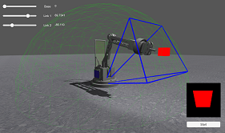
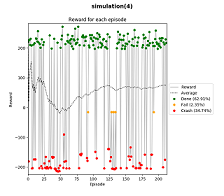
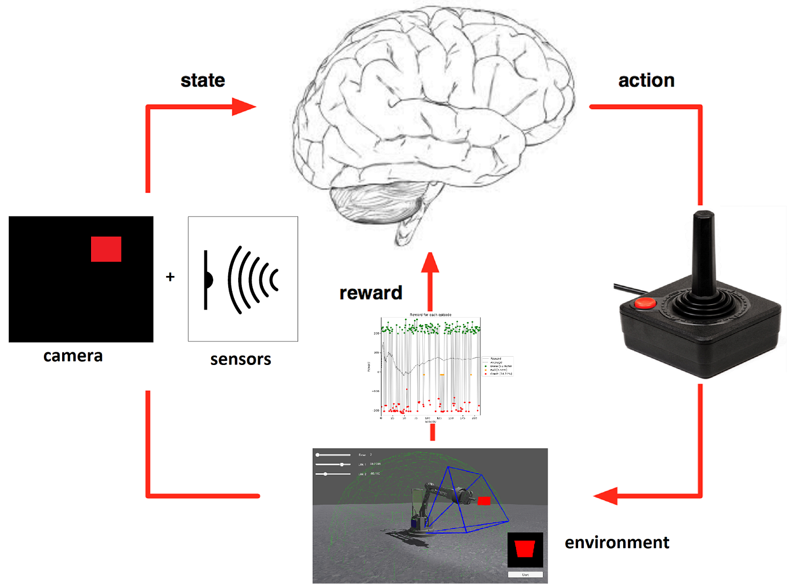

# Deep reinforcement learning for a robot arm via a Unity-Python interface

 
The main goal of this project is **to allow a robot arm to learn by itself how to press a red button**.
  

## Environment

 

An **Unity environment** was created to simulate the robot and his envirnement.

+ The robot is in the center
+ The red cube represents the button
+ The green sphere represents the cube potential position
+ The blue area represents the cube position limit
+ The output camera is displayed at the bottom right
+ A start button is implemeted to launch the simulation

For more information on the Unity environment, see the Readme in Unity/Assets/RL Robot/

 The **shell displays some information** about the program proceedings.

The **results are represented as graphs**.

A **server** makes the link between our python script and our .exe simulation. It then allows to communicate the robot. 

  

## Algorithm

The chosen solution is to use a **deep reinforcement learning algorithm**.

>For information, some good courses about this method :
>+ https://medium.com/emergent-future/simple-reinforcement-learning-with-tensorflow-part-0-q-learning-with-tables-and-neural-networks-d195264329d0
>+ https://www.intelnervana.com/demystifying-deep-reinforcement-learning/
>+ http://www0.cs.ucl.ac.uk/staff/d.silver/web/Teaching.html
>+ http://cs231n.github.io/

The algorithm use :
+ A **convolutional neural network** (CNN) based on _DeepMind_ to find the action from the robot state
+ A **policy gradient approach** to update the CNN (`loss = -log(π)*A`)

  

# Getting started

## Installation 

### Prerequisites
- OS : Windows (Linux in progress)

### Dependencies

+ TensorFlow
+ Numpy
+ PIL
+ Matplotlib

### Clone GitLab environment

In your personnal folder, clone the GitLab environement: 
`git clone https://gitlab.com/RoboAcademy/UnityPySocket`

<b>WARNING !</b> Before continue, you have to unzip the Unity build in `(your folder)\UnityPySocket\Unity\Build\Build`

## Usage

### Launch the script

From `(your folder)\UnityPySocket\Python\Python`, launch the script: 
`python main.py`

**Several keystrokes** will be requested from the user.

1. `Open Unity environment (y/n)`  : Open robot simulation 
2. `Name of the built executable:` : Inform the name of the .exe file
3. `Use manual position (y/n)`     : 2 types of script (manual or learning)
>`Restore session (y/ n)`        : Relaunch an existing simulation **(if learning script is chosen)**
5. Click on the `start` button of the robot environment

You can enter 'n' to the first prompt and connect the unity environment manually, either running a built executable or simply running from inside the editor.
Otherwise if you enter 'y', Python will attempt to run the executable in (your folder)\UnityPySocket\Unity\Build.

To see both of these scenarios, watch this YouTube video: https://www.youtube.com/watch?v=7ZNFCuZZ3nc

Here we go ! The simulation is launched !

## Authors

+ **Jacob THORN**
+ **Tristan BIDOUARD**   
With the help of : 
+ **Santiago QUINTANA-AMATE**
+ **Pablo BERMELL-GARCIA** 
+ **Kiran KRISHNAMURTHY**  
 
From _AIRBUS GROUP UK_
 

